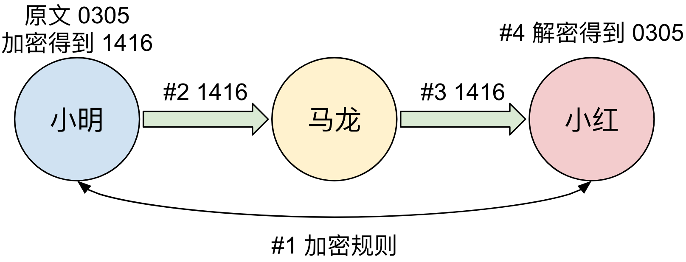
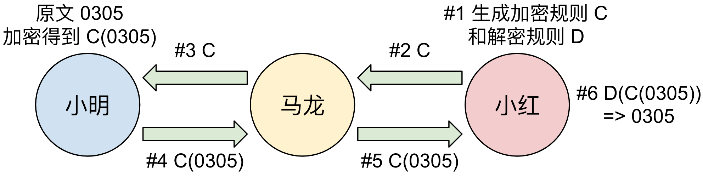

# 1.1. 分布式系统与密码学

## 分布式系统
“分布式系统”（Distributed System）是计算机领域的一个传统研究分支。简单来说，分布式系统是指多台独立的计算机通过网络通信的方式交互数据、互相合作，组成一个抽象统一的服务系统。从外部使用者的角度看来，这多台计算机组成是一个整体，使用者并不需要关注是哪些计算机在提供服务。

为什么会出现分布式的系统？这要从计算机的发展说起，冯诺依曼体系里的一台独立计算机有独立的运算器（CPU）和存储器（内存和磁盘），早期的计算机服务应用可以通过一台计算机实现，例如存储与访问文件。伴随着摩尔定律下的硬件升级换代，一台计算机能够提供的服务规模随之上升。在这样的发展体系中，其代表产物当属 20 世纪 50~60 年代的 IBM System 360 大型机，占据了当时企业计算机市场七成以上的份额，企业只需要一台这样的大型机，就能为所有员工的低端计算机提供内部服务。

但随着互联网概念的兴起，一些计算机应用需要通过网络为全球的用户提供服务，每秒需要处理数十万的功能请求，无论从计算力（CPU）还是存储大小、读写频率上（内存和磁盘）考虑，摩尔定律更新下的一台大型机也无法提供这种规模的服务。随之而来解决办法有两种：一是所有计算机运行相同程序，将不同请求任务分发给不同的计算机进行处理，减少单一计算机的压力；二是把一个请求任务的处理拆成多个部分，每台计算机只做一个部分，然后将结果传递给下一台计算机，就像工厂的流水线一样。现在的分布式系统混合着上述两种解决方法，对两者不进行详细区分，前者通常称为集群，后者称为流式计算。互联网业务的实时性提高了对软件可用性的要求，因此分布式系统也常用来实现备份和容错，例如集群系统，其中一台计算机无法使用不影响整个集群的可用性。

21 世纪第二个十年，火热的云计算、大数据概念更是将“分布式系统”融化于无形之中，因为所有的系统都是分布式的。虚拟化技术是云计算的根基，它从硬件和操作系统的层面上实现了分布式，抽象出一个“云”，云上没有计算机只有“资源”，包括计算资源、网络资源、存储资源等，应用只需要请求对应的资源用来完成功能服务。从计算机硬件的层面，运行在云上的程序都是分布式的，云已经实现了资源切换、硬件容错等功能；但从软件应用层面，一个程序实例能调度的资源有限，开发者依然需要运行多个程序实例来实现分布式架构。

分布式系统在发展的过程中，学术界和工业界都对其有深入的研究，出现了许多杰出的理论，包括对于容错、可信节点、共识的数学分析和工程实践。区块链本身是一个大型分布式系统，每个加入到区块链系统的计算机都是该分布式系统中的一个节点，每个节点都在做计算、存储备份、数据广播、共识，并且由于节点分布在全球各地并且不可控、不可信，设计好的容错和共识机制对于区块链系统来说是一个巨大的挑战。回归本质，区块链系统解决的问题依然属于分布式系统的范畴中，因此许多概念、理论和解决方法与传统分布式系统是共通的，区块链概念的产生站在了分布式系统数十年研究成果的巨人肩膀上。

## 密码学
“密码学”（Cryptography）是一门古老的学科，密码学一词源于希腊语 kryptós “隐藏的” 和 gráphein “书写”。小学生上课传纸条写悄悄话创造一些特殊的符号不让中间人看懂，就不知不觉涉及到了密码学。可以说，密码学在人类诞生之初有交流的需求时就存在。

从学术角度上看，密码学主要分为“古典密码学”和“现代密码学”。古典密码学主要是关于加密隐藏和解密破译的研究，远的有中国古代的藏头诗，近的有第二次世界大战传递军事情报用的加密和解密机。现代密码学起源于 20 世纪末出现的大量相关理论，其主要关注加密信息的完整性和安全性验证，对信息的不可抵赖签名等。区块链系统大量运用了现代密码学的研究成果，这里介绍一下“非对称加密”和“数字签名”。

对称加密很好理解，藏头诗、二战密码机都是对称加密。对称加密需要有一套规则，例如小明和小红分隔两地，现在需要传递一个数字：

1. 小明和小红事先约定好加密解密规则，原始数字每一位加 1 就是加密信息。
2. 小明需要传递 `0305` 给小红，他把一张写有 `1416` 的纸交给邮差马龙。
3. 马龙将纸条交给小红。
4. 小红拿到写有 `1416` 的纸后，按照事先加密规则反过来将每一位数字减 1 就得到了小明想要传递的原始信息 `0305`。

在上述的第三步中，马龙即使看到了纸上的加密信息也不得知晓小明传递的原始信息，这就保护了小明和小红传递信息的隐私性。

这里存在两个问题：

* 小明和小红需要事先约定好加密和解密规则，如果他们无法事先约定怎么办？
* 邮差马龙如果是坏人，把写有 `1416` 的纸替换了，小红如何验证得到的加密信息没有被调包？

第一个问题的解决方案就是 **非对称加密**，有许多依靠数学性质的非对称加密算法，这里不详细介绍。利用非对称加密，小明和小红的信息传递步骤如下：

1. 小红利用非对称加密算法，生成一对独一无二的加密规则 `C`（公钥）和解密规则 `D`（私钥），解密规则无法通过加密规则反推得到。
2. 小红把加密规则 `C` 写在纸上，交给邮差马龙。
3. 邮差马龙将加密规则 `C` 交给小明。
4. 小明利用小红传递的加密规则将原始信息加密 `C(0305)`，交给邮差马龙。
5. 邮差马龙将加密信息 `C(0305)` 交给小红。
6. 小红用之前生成的解密规则对信息解密 `D(C(0305))`，得到小明的原始信息 `0305`。

在上述第五步中，马龙即使有加密规则 `C` 和加密后的信息 `C(0305)`，也无法得到原始信息，因为加密和解密的规则互相是不可反推的。但这个方法依然没有解决第二个问题，如果坏的马龙把 `C(0305)` 调包成 `C(1234)` 让小红解密除了虚假的信息怎么办？

反过来想，如果把解密规则公开（作为公钥），把加密规则保留（作为私钥），加密者发布用私钥加密的信息如果能通过公开公钥解密，那么加密信息本身就是对加密者身份的背书，这样就杜绝了伪造加密者发布的虚假信息，这样的方法叫做 **数字签名**。

但是，公开的公钥本身就是不可信的，只有信任得到的公钥才能信任用公钥解密的信息，因此这里存在一个信任链的问题。在目前的真实应用场景中，HTTPS 协议是非对称加密最广泛的应用，公钥通常需要有“权威机构”的数字签名才可信，因此这条信任链的底部是中心化的权威机构。

区块链系统中大量运用了非对称加密和数字签名技术，私钥是区块链系统中证明身份的唯一手段。
